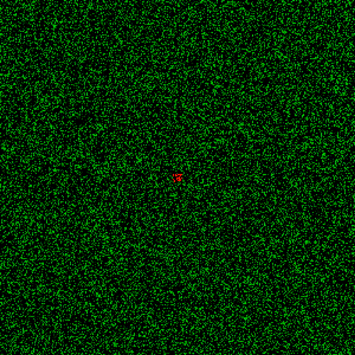

# Large-Scale Wildfire Simulation


# Quickstart


To install the simulation, do:
```shell
git clone https://github.com/tomek-l/fire-simulation
cd fire-simulation
pip3 install -r requirements.txt
python3 example.py
```

You should see a new directory with simulation output. It has a bunch of png files containing the output.
```shell
cd sim_output_cells=(100, 100)_steps=1000_ignition_prob=0.2_burn_rate=3_time=2020-03-13 18:52:09.614562
```

If you want to assemble the files into an animation, you can do so using ```ffmpeg```
```shell
ffmpeg -i out%03d.png -c:v libx264 -crf 0 -preset veryslow -c:a libmp3lame -b:a 320k output.mp4
```

The result will look somewhat like this:



To change the parameters of the simulation, experiment with values of these parameters in ```example.py```:

```python
sim_args = {
    'state_array': state,
    'fuel_array': fuel,
    'burn_rate': 3,
    'n_steps': 100,
    'ignition_prob': 0.2,
    'n_epochs': 10
}
```

To benchmark the simulation on your processor do:
```
cd benchmarks
bash run_bench.sh
```